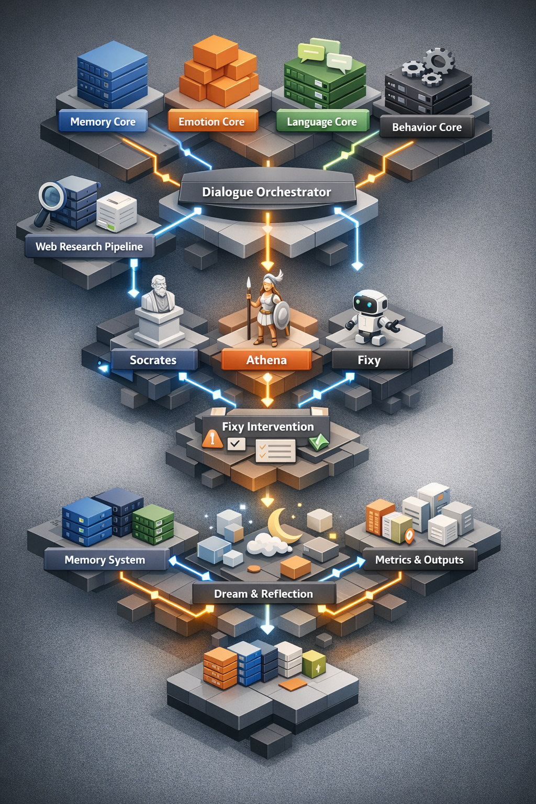
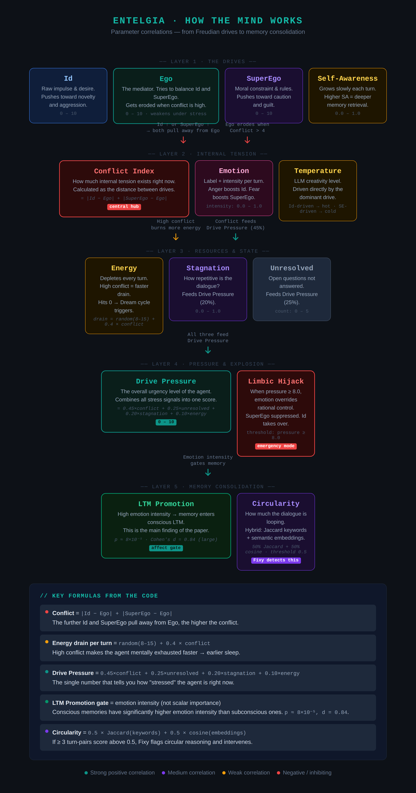

<div style="display: flex; align-items: center; justify-content: space-between;">
  
  <h1 style="flex-grow: 1; text-align: center; font-size: 2.5em; font-weight: bold; margin: 0;">🧠 Entelgia</h1>
  <div style="width: 120px;" aria-hidden="true"></div>
</div>

[](https://docs.python.org/3.10/)
[](#-project-status)
[](https://github.com/sivanhavkin/Entelgia/actions)
[](LICENSE)
[](https://black.readthedocs.io/en/stable/)
[](https://github.com/sivanhavkin/Entelgia/actions)
[](https://flake8.pycqa.org/)  
[](https://github.com/sivanhavkin/Entelgia/commits/main)
[](https://github.com/sivanhavkin/Entelgia)
[](https://github.com/sivanhavkin/Entelgia/tree/main/docs)
[](https://doi.org/10.5281/zenodo.18754895)
[](https://doi.org/10.5281/zenodo.18774720)

---

## Entelgia — A Dialogue-Governed Multi-Agent AI Architecture

**Entelgia** is an experimental multi-agent AI architecture.  
It studies how persistent identity, internal conflict dynamics, and behavioral regulation can emerge through long-term memory and structured dialogue.

**Use Entelgia if you want agents that evolve an internal identity — not just follow prompts.**  
  
Unlike stateless chatbot systems, Entelgia maintains an evolving internal state, allowing identity, memory, and reflective behavior to develop over time.

Entelgia sits between agent engineering and cognitive architecture research, exploring how internal structure shapes agent behavior.  

---

### Mental Model (30 seconds)

```
LLM + Persistent Memory + Psychological Drives + Observer Regulation --> Dialogue-governed agents
```
---

### Why Entelgia Exists

Most agent systems optimize outputs.
Entelgia explores how internal structure regulates behavior over time.

Instead of external guardrails, agents develop regulation through:
- memory continuity
- internal conflict
- observer feedback loops

---

## 🎭 See Entelgia in Action
<p align="center">
  
</p>

<p align="center">
  
</p>

📄 Full Professional Demo: 
[Entelgia Full Demo](docs/entelgia_demo.md)

🎬 Animated preview:


### What is "Research Hybrid"?

Entelgia is a **Research Hybrid** — combining experimental AI research with a stable engineering foundation.  
It explores new multi-agent and cognitive ideas while remaining usable and reliable in real projects.  
Some components evolve rapidly, but changes are introduced carefully to preserve stability.  
The project welcomes both researchers and developers building persistent, reflective AI agents.

---

## 📋 Requirements

* Python **3.10+**
* **LLM backend** — choose one:
  * **Ollama** (local, free) — requires ~8GB+ RAM and a 7B+ model download
  * **Grok** (xAI cloud) — requires `GROK_API_KEY` and internet access
  * **OpenAI** (cloud) — requires `OPENAI_API_KEY` and internet access
  * **Anthropic** (cloud) — requires `ANTHROPIC_API_KEY` and internet access
* At least one supported model (see backend-specific sections below)
* **8GB+ RAM** recommended for Ollama (16GB+ for larger models); not required for cloud backends

For the complete dependency list, see [`requirements.txt`](requirements.txt).

---

## 🧠 LLM Backends Explained

Before installing, it helps to understand the two ways Entelgia can talk to a language model: **locally via Ollama** or **remotely via a cloud API**.

### What is Ollama?

[Ollama](https://ollama.com) is a free, open-source tool that lets you download and run large language models (LLMs) entirely on your own machine — no internet connection required after the initial model download, and no API key needed.

When you run `ollama serve`, it starts a small local server (by default on `http://localhost:11434`) that Entelgia connects to exactly the same way it would connect to a remote API — except everything stays on your hardware.

**Why Ollama exists:** cloud-hosted LLMs charge per token and send your prompts to third-party servers. Ollama gives you a private, cost-free alternative.

### Local LLM (Ollama) vs. Cloud API — Key Differences

| | **Local (Ollama)** | **Cloud API (Grok / OpenAI / Anthropic)** |
|---|---|---|
| **Cost** | Free (electricity only) | Pay-per-token (or subscription) |
| **Privacy** | Fully local — prompts never leave your machine | Prompts sent to the provider's servers |
| **Internet** | Not required after model download | Always required |
| **Setup** | Install Ollama + download model (~4–15 GB) | Get an API key, set env variable |
| **Speed** | Depends on your hardware (CPU/GPU) | Fast, runs on provider's infrastructure |
| **Model quality** | Good — 7B–34B models rival smaller cloud models | Typically state-of-the-art |
| **RAM needed** | 8 GB+ (16 GB+ recommended for best results) | None on your machine |

### Which should I choose?

* **Choose Ollama** if you want privacy, zero ongoing cost, or offline use. A machine with 16 GB RAM and a GPU will give the best experience.
* **Choose a cloud API** (Grok, OpenAI, Anthropic) if you want the highest model quality with minimal local setup, and you are comfortable sharing prompts with a third-party provider.

Both backends are fully supported and can be switched at each startup.

---

## 🚀 **AUTOMATIC INSTALL** (Recommended)

> **⚡ Get started fast with our automated installer!**

```bash
# Clone the repository
git clone https://github.com/sivanhavkin/Entelgia.git
cd Entelgia

# Run the automated installer
python scripts/install.py
```

📄 **View installer source:** [`scripts/install.py`](https://github.com/sivanhavkin/Entelgia/blob/main/scripts/install.py)

### What the installer does:

1. ✅ **Asks you to choose your backend** — Ollama (local), Grok (xAI cloud), OpenAI (cloud), or Anthropic (cloud) — before doing anything else
2. ✅ **Ollama path only:** Detects/installs Ollama (macOS via Homebrew; provides instructions for Linux/Windows) and pulls the `qwen2.5:7b` model (or lets you skip)
   > ⚠️ **Note:** If you choose Ollama, automatic installation may not work on all platforms. Please check the [Manual Installation — Install Ollama](#1️⃣-install-ollama) section below to install Ollama manually if needed.
3. ✅ **Creates `.env` configuration** from template
4. ✅ **Configures API keys in one step** — generates a secure `MEMORY_SECRET_KEY`; if a cloud backend was chosen, also prompts for the corresponding API key (`GROK_API_KEY`, `OPENAI_API_KEY`, or `ANTHROPIC_API_KEY`)
5. ✅ **Installs Python dependencies** from `requirements.txt`

### After installation:

```bash

# run the full system (30 minutes, stops when time limit is reached)
python Entelgia_production_meta.py

# Or run 200 turns with no time-based stopping (guaranteed to complete all turns)
python Entelgia_production_meta_200t.py
```

> 💡 **Having issues?** Check the [Troubleshooting Guide](TROUBLESHOOTING.md) for common problems and solutions.

---

## 🔧 Manual Installation

If automatic installation isn't possible, follow these steps:

### 1️⃣ Install Ollama

Entelgia requires **Ollama** for local LLM execution.

**macOS:**
```bash
brew install ollama
```

**Linux:**
```bash
curl -fsSL https://ollama.com/install.sh | sh
```

**Windows:**
- Download installer from [ollama.com/download/windows](https://ollama.com/download/windows)
- Or use WSL2 with the Linux installation method

👉 More info: [ollama.com](https://ollama.com)

### 2️⃣ Pull an LLM Model

```bash
ollama pull qwen2.5:7b
```

Recommended models (8GB+ RAM recommended):

> ⚠️ **Practical minimum:** Entelgia requires a **7B-parameter or larger model** (e.g., `qwen2.5:7b`, `llama3.1:8b`, or `mistral:latest`). Smaller models may execute but do not reliably handle the architecture's reflective, memory-heavy, multi-layer reasoning demands.

* **qwen2.5:7b** – Recommended default; strong reasoning and instruction following
* **llama3.1:8b** – Excellent general-purpose performance
* **mistral:latest** – Balanced reasoning and conversational coherence
* **llama3.1:70b** or larger – Best results for deep philosophical dialogue

### 3️⃣ Install Dependencies

```bash
pip install -r requirements.txt
```

### 4️⃣ Configure Environment

```bash
# Copy environment template
cp .env.example .env

# Generate secure key (or add your own)
python -c "import secrets; print(secrets.token_hex(32))"

# Add the key to .env file:
# MEMORY_SECRET_KEY=<generated-key>
```

### 5️⃣ Run Entelgia

```bash
# Start Ollama (if not already running)

ollama serve

# run the full system (30 minutes, stops when time limit is reached)
python Entelgia_production_meta.py

# Or run 200 turns with no time-based stopping (guaranteed to complete all turns)
python Entelgia_production_meta_200t.py
```

---

## ☁️ Using the Grok Backend (xAI)

Entelgia supports **Grok** (by xAI) as an alternative cloud-based LLM backend alongside the default Ollama local backend.

### 1️⃣ Get a Grok API Key

1. Go to [https://console.x.ai](https://console.x.ai) and sign in with your X (Twitter) account.
2. In the left sidebar click **"API Keys"**.
3. Click **"Create API Key"**, give it a name, and copy the generated key.

### 2️⃣ Add the Key to `.env`

During installation (`python scripts/install.py`) you will be prompted to enter your Grok API key — it is saved automatically.

To add it manually, open your `.env` file and set:

```
GROK_API_KEY=your_key_here
```

### 3️⃣ Select Grok at Startup

When you run Entelgia, it will interactively ask you to choose a backend:

```
Select backend:
  [1] grok
  [2] ollama
  [3] openai
  [4] anthropic
  [0] defaults (keep config as-is)
```

Choose **[1] grok** and then select a model for each agent from the available Grok models:

| Model | Description |
|---|---|
| `grok-4.20-multi-agent` | Multi-agent capable, latest |
| `grok-4-1-fast-reasoning` | Fast reasoning, high performance |

> 💡 The Grok backend requires an active internet connection and a valid `GROK_API_KEY` in `.env`. No local Ollama instance is needed when using Grok.

---

## 🤖 Using the OpenAI Backend

Entelgia supports **OpenAI** as a cloud-based LLM backend. No local Ollama instance is needed when using OpenAI.

### 1️⃣ Get an OpenAI API Key

1. Go to [https://platform.openai.com](https://platform.openai.com) and sign in.
2. In the left sidebar click **"API keys"**.
3. Click **"Create new secret key"**, give it a name, and copy the generated key.

### 2️⃣ Add the Key to `.env`

During installation (`python scripts/install.py`) you will be prompted to enter your OpenAI API key — it is saved automatically.

To add it manually, open your `.env` file and set:

```
OPENAI_API_KEY=your_key_here
```

### 3️⃣ Select OpenAI at Startup

When you run Entelgia, choose **[3] openai** from the backend menu. You will then be prompted to select an OpenAI model:

| Model | Description |
|---|---|
| `gpt-4.1` | Latest GPT-4.1 model |
| `gpt-4o` | GPT-4o multimodal model |
| `gpt-4o-mini` | Fast and affordable GPT-4o variant |
| `gpt-4.1-mini` | Compact GPT-4.1 model |

> 💡 The OpenAI backend requires an active internet connection and a valid `OPENAI_API_KEY` in `.env`. No local Ollama instance is needed when using OpenAI.

---

## 🧬 Using the Anthropic Backend

Entelgia supports **Anthropic** (Claude) as a cloud-based LLM backend. No local Ollama instance is needed when using Anthropic.

### 1️⃣ Get an Anthropic API Key

1. Go to [https://console.anthropic.com](https://console.anthropic.com) and sign in.
2. In the left sidebar click **"API Keys"**.
3. Click **"Create Key"**, give it a name, and copy the generated key.

### 2️⃣ Add the Key to `.env`

During installation (`python scripts/install.py`) you will be prompted to enter your Anthropic API key — it is saved automatically.

To add it manually, open your `.env` file and set:

```
ANTHROPIC_API_KEY=your_key_here
```

### 3️⃣ Select Anthropic at Startup

When you run Entelgia, choose **[4] anthropic** from the backend menu. You will then be prompted to select a Claude model:

| Model | Description |
|---|---|
| `claude-opus-4-6` | Most capable Claude model |
| `claude-sonnet-4-6` | Balanced performance and speed |
| `claude-haiku-4-5` | Fast and lightweight |

> 💡 The Anthropic backend requires an active internet connection and a valid `ANTHROPIC_API_KEY` in `.env`. No local Ollama instance is needed when using Anthropic.

---

## 📦 Installation from GitHub

For development or integration purposes:

```bash
# Install from GitHub (recommended)
pip install git+https://github.com/sivanhavkin/Entelgia.git

# Or clone and install in editable mode
git clone https://github.com/sivanhavkin/Entelgia.git
cd Entelgia
pip install -e .
```

### 🔄 Upgrading

```bash
pip install --upgrade git+https://github.com/sivanhavkin/Entelgia.git@main
```

---

## 🗑️ Memory Management

Entelgia provides a utility to clear stored memories when needed. The `clear_memory.py` script allows you to delete:

- **Short-term memory** (JSON files in `entelgia_data/stm_*.json`)
- **Long-term memory** (SQLite database in `entelgia_data/entelgia_memory.sqlite`)
- **All memories** (both short-term and long-term)

### Usage

```bash
python scripts/clear_memory.py
```

The script will prompt you with an interactive menu:

```
============================================================
Entelgia Memory Deletion Utility
============================================================

What would you like to delete?

1. Short-term memory (JSON files)
2. Long-term memory (SQLite database)
3. All memories (both short-term and long-term)
4. Exit
```

**Safety features:**
- ⚠️ Confirmation required before deletion
- 📊 Shows count of files/entries before deletion
- 🔒 Cannot be undone - use with caution

### When to Use

- **Reset experiments** - Start fresh with new dialogue sessions
- **Privacy concerns** - Remove stored conversation data
- **Testing** - Clear state between test runs
- **Storage management** - Free up disk space

**Note:** Deleting memories will remove all dialogue history and context. The system will start fresh on the next run.

---

## 📚 Documentation

* 📘 **[Full Whitepaper](whitepaper.md)** - Complete architectural and theoretical foundation
* 📄 **[System Specification (SPEC.md)](./SPEC.md)** - Detailed architecture specification
* 🏗 **[Architecture Overview (ARCHITECTURE.md)](ARCHITECTURE.md)** - High-level and component design
* 🗺️ **[Roadmap (ROADMAP.md)](ROADMAP.md)** - Project development roadmap and future plans
* 📖  [Entelgia Demo(entelgia_demo.py)](https://github.com/sivanhavkin/Entelgia/blob/main/entelgia_demo.md) - See the system in action
* 🌐 **[Web Research Demo (entelgia_research_demo.py)](entelgia_research_demo.py)** - Fixy-triggered web search demo
* ❓ **[FAQ](FAQ.md)** - Frequently asked questions and answers
* 🔧 **[Troubleshooting Guide](TROUBLESHOOTING.md)** - Common issues and solutions
* 🧪 **[Test Suite (tests/README.md)](tests/README.md)** - Full test documentation and CI/CD details
* ⚙️ **[Configuration (docs/CONFIGURATION.md)](docs/CONFIGURATION.md)** - All configuration options

---

## ✨ Core Features

* **Multi-agent dialogue** (Socrates · Athena · Fixy)
* **Persistent memory** — short-term (JSON) + long-term (SQLite) with 🔐 HMAC-SHA256 integrity
* **Enhanced Dialogue Engine** — dynamic speaker selection, seed strategies, `AgentMode` constants
* **🎨 Topic-Aware Style Selection**
* **🎨 Two-Layer Tone Enforcement**
* **🔁 Dialogue Loop Guard**
* **🔍 Semantic Repetition Detection**
* **🚫 Observer Toggle**
* **⚡ Energy-Based Regulation** — dream cycle consolidation, hallucination-risk detection
* **🧠 Personal Long-Term Memory** — DefenseMechanism, FreudianSlip, SelfReplication
* **🎛️ Drive-Aware Cognition** — dynamic LLM temperature, superego critique, ego-driven memory depth
* **🧠 Limbic Hijack**
* **🔥 Drive Pressure**
* **📊 Dialogue Quality Metrics**
* **🔬 Ablation Study**
* **🛡️ Safety & Quality** — PII redaction, output artifact cleanup, memory poisoning protection
* **🌐 Web Research Module**
* **🗂️ Forgetting Policy**
* **💡 Affective Routing**
* **🏷️ Confidence Metadata**

---

## ⚙️ Configuration

For all configuration options, see **[docs/CONFIGURATION.md](docs/CONFIGURATION.md)**.

---

## 🏗 Architecture Overview

Entelgia is built around a modular **CoreMind** system — a layered stack of cognitive modules that work together to enable persistent, reflective, and psychologically grounded multi-agent dialogue.

### 🧩 CoreMind Modules

| Module | Role |
|--------|------|
| `Conscious` | Reflective narrative construction |
| `Memory` | Persistent identity continuity across sessions |
| `Emotion` | Affective weighting & regulation |
| `Language` | Dialogue-driven cognition |
| `Behavior` | Goal-oriented response shaping |
| `Observer` | Meta-level monitoring & correction |
| `EnergyRegulator` | Cognitive energy supervision & dream cycles |
| `WebResearch` | External knowledge retrieval & credibility evaluation |

### 🤝 The Three Agents

Each dialogue is driven by three agents with distinct psychological profiles:

| Agent | Personality | Role |
|-------|-------------|------|
| 🏛️ **Socrates** | Investigative questioner | Domain-aware inquiry; probes assumptions and causal chains |
| 🦉 **Athena** | Strategic synthesizer | Builds frameworks and structured explanations in domain vocabulary |
| 🔍 **Fixy** | Meta-cognitive supervisor | Diagnostic observer; identifies contradictions and reasoning gaps |

### 📦 Package Structure

For the complete file and module layout — including all `entelgia/` modules, entry points, scripts, tests, and docs — see **[PACKAGE_STRUCTURE.md](PACKAGE_STRUCTURE.md)**.

---

## 🧪 Test Suite

Entelgia ships with **1956 tests** across 40 suites.

For full test documentation, per-suite details, CI/CD pipeline information, and sample output, see the **[Test Suite README (tests/README.md)](tests/README.md)**.

To run all tests:

```bash
pytest tests/ -v
```

---

## 📦 Version Information

| Version | Status | Notes |
|---------|--------|-------|
| **v5.0.0** | ✅ **Latest** | current |
| **v4.1.0** | ✅ **Stable** | previous stable release |
| **v4.0.0** | ✅ **Stable** | previous stable release |
| **v3.0.0** | ⚠️ Superseded | Use v5.0.0 instead |
| **v2.8.1** | ⚠️ Superseded | Use v5.0.0 instead |
| **v2.8.0** | ⚠️ Superseded | Use v5.0.0 instead |

💡 **Note:** Starting from v2.1.1, we follow a controlled release schedule. Not every commit results in a new version. For the full version history, see [Changelog.md](Changelog.md).

---

### Release Schedule

- 🗓️ **Minor releases**: Every week (feature batches)
- 🐛 **Patch releases**: As needed for critical bugs
- 🚨 **Hotfixes**: Within 24h for security issues

📖 See [Changelog.md](Changelog.md) for detailed version history.

---

## 📄 Research Papers

**1. Internal Structural Mechanisms and Dialogue Stability in Multi-Agent Language Systems: An Ablation Study**

Sivan Havkin (2026)  
Independent Researcher, Entelgia Labs

DOI:
https://doi.org/10.5281/zenodo.18754895

This paper presents an ablation study examining how internal structural mechanisms influence dialogue stability and progression in multi-agent language systems.

**2. The Entelgia architecture is documented in the following research preprint:**

DOI: https://doi.org/10.5281/zenodo.18774720

This publication describes the cognitive-agent framework, META behavioral metrics,
and the reproducibility methodology behind the project.

---

## 📚 Citation

If you use or reference this work, please cite:

```bibtex
@misc{havkin2026entelgia,
  author = {Havkin, Sivan},
  title = {Internal Structural Mechanisms and Dialogue Stability in Multi-Agent Language Systems: An Ablation Study},
  year = {2026},
  publisher = {Zenodo},
  doi = {10.5281/zenodo.18752028},
  url = {https://doi.org/10.5281/zenodo.18752028}
}
```

```bibtex
@misc{havkin2026attractors,
  author = {Havkin, Sivan},
  title = {Personality Attractors and Dominance Lock in Dialogue-Based Cognitive Agents: An Exploratory Study within the Entelgia Architecture},
  year = {2026},
  publisher = {Zenodo},
  doi = {10.5281/zenodo.18774720},
  url = {https://doi.org/10.5281/zenodo.18774720}
}
```

---

## 📄 License

Entelgia is released under the **MIT License**.

This ensures the project remains open, permissive, and compatible with the broader open‑source ecosystem, encouraging research, experimentation, and collaboration.

For the complete legal terms, see the `LICENSE` file included in this repository.

---

## 👤 Author

Conceived and developed by **Sivan Havkin**.

---

## 📊 Project Status

* **Status:** Research / Production Hybrid
* **Version:** 5.0.0 
* **Last Updated:** 26 March 2026
---
