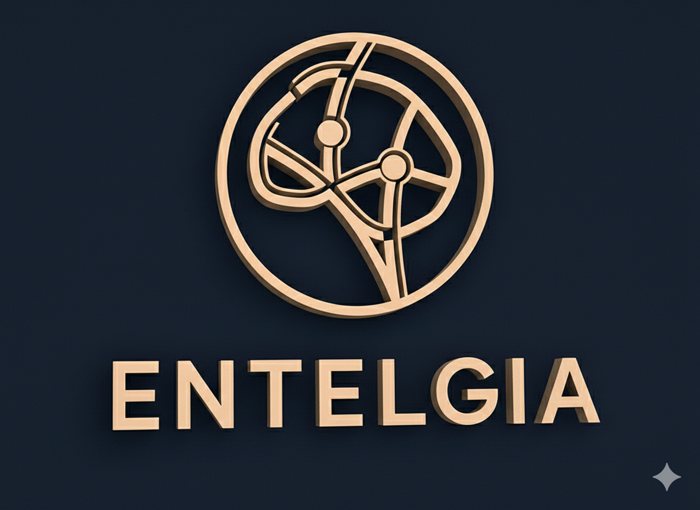
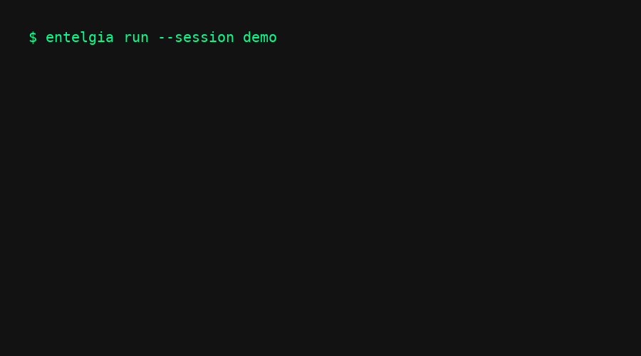

<div style="display: flex; align-items: center; justify-content: space-between;">
  
  <h1 style="flex-grow: 1; text-align: center; font-size: 2.5em; font-weight: bold; margin: 0;">🧠 Entelgia</h1>
  <div style="width: 120px;" aria-hidden="true"></div>
</div>

[](https://docs.python.org/3.10/)
[](#-project-status)
[](https://github.com/sivanhavkin/Entelgia/actions)
[](LICENSE)
[](https://black.readthedocs.io/en/stable/)
[](https://github.com/sivanhavkin/Entelgia/actions)
[](https://flake8.pycqa.org/)  
[](https://github.com/sivanhavkin/Entelgia/commits/main)
[](https://github.com/sivanhavkin/Entelgia)
[](https://github.com/sivanhavkin/Entelgia/tree/main/docs)
[](https://doi.org/10.5281/zenodo.18754895)
[](https://doi.org/10.5281/zenodo.18774720)

---

## Entelgia — A Dialogue-Governed Multi-Agent AI Architecture

**Entelgia** is an experimental multi-agent AI architecture.  
It studies how persistent identity, internal conflict dynamics, and behavioral regulation can emerge through shared long-term memory and structured dialogue.

**Use Entelgia if you want agents that evolve an internal identity — not just follow prompts.**  
  
Unlike stateless chatbot systems, Entelgia maintains an evolving internal state, allowing identity, memory, and reflective behavior to develop over time.

Entelgia sits between agent engineering and cognitive architecture research, exploring how internal structure shapes agent behavior.  

---

### Mental Model (30 seconds)

```
LLM + Persistent Memory + Psychological Drives + Observer Regulation --> Dialogue-governed agents
```
---

### Why Entelgia Exists

Most agent systems optimize outputs.
Entelgia explores how internal structure regulates behavior over time.

Instead of external guardrails, agents develop regulation through:
- memory continuity
- internal conflict
- observer feedback loops

---

## 🎭 See Entelgia in Action

📄 Full Professional Demo: 
[Entelgia Full Demo](docs/Entelgia_Full_Demo.pdf)

🎬 Animated preview:


### What is "Research Hybrid"?

Entelgia is a **Research Hybrid** — combining experimental AI research with a stable engineering foundation.  
It explores new multi-agent and cognitive ideas while remaining usable and reliable in real projects.  
Some components evolve rapidly, but changes are introduced carefully to preserve stability.  
The project welcomes both researchers and developers building persistent, reflective AI agents.

---

## 📋 Requirements

* Python **3.10+**
* **Ollama** (local LLM runtime)
* At least one supported model (`phi3`, `mistral`, etc.)
* **8GB+ RAM** recommended (16GB+ for larger models)

For the complete dependency list, see [`requirements.txt`](requirements.txt).

---

## 🚀 **AUTOMATIC INSTALL** (Recommended)

> **⚡ Get started fast with our automated installer!**

```bash
# Clone the repository
git clone https://github.com/sivanhavkin/Entelgia.git
cd Entelgia

# Run the automated installer
python scripts/install.py
```

📄 **View installer source:** [`scripts/install.py`](https://github.com/sivanhavkin/Entelgia/blob/main/scripts/install.py)

### What the installer does:

1. ✅ **Detects and installs Ollama** (macOS via Homebrew; provides instructions for Linux/Windows)
2. ✅ **Pulls the `phi3` model** automatically (or lets you skip)
3. ✅ **Creates `.env` configuration** from template
4. ✅ **Generates secure `MEMORY_SECRET_KEY`** (48-char cryptographic key)
5. ✅ **Installs Python dependencies** from `requirements.txt`

### After installation:

```bash
# Start Ollama service
ollama serve

# run the full system (30 minutes, stops when time limit is reached)
python Entelgia_production_meta.py

# Or run 200 turns with no time-based stopping (guaranteed to complete all turns)
python Entelgia_production_meta_200t.py
```

> 💡 **Having issues?** Check the [Troubleshooting Guide](TROUBLESHOOTING.md) for common problems and solutions.

---

## 🔧 Manual Installation

If automatic installation isn't possible, follow these steps:

### 1️⃣ Install Ollama

Entelgia requires **Ollama** for local LLM execution.

**macOS:**
```bash
brew install ollama
```

**Linux:**
```bash
curl -fsSL https://ollama.com/install.sh | sh
```

**Windows:**
- Download installer from [ollama.com/download/windows](https://ollama.com/download/windows)
- Or use WSL2 with the Linux installation method

👉 More info: [ollama.com](https://ollama.com)

### 2️⃣ Pull an LLM Model

```bash
ollama pull phi3
```

Recommended models (8GB+ RAM recommended):
* **phi3 (3.8B)** – Fast & lightweight [recommended for 8GB systems]
* **mistral (7B)** – Balanced reasoning
* **neural-chat (7B)** – Strong conversational coherence

### 3️⃣ Install Dependencies

```bash
pip install -r requirements.txt
```

### 4️⃣ Configure Environment

```bash
# Copy environment template
cp .env.example .env

# Generate secure key (or add your own)
python -c "import secrets; print(secrets.token_hex(32))"

# Add the key to .env file:
# MEMORY_SECRET_KEY=<generated-key>
```

### 5️⃣ Run Entelgia

```bash
# Start Ollama (if not already running)

ollama serve

# run the full system (30 minutes, stops when time limit is reached)
python Entelgia_production_meta.py

# Or run 200 turns with no time-based stopping (guaranteed to complete all turns)
python Entelgia_production_meta_200t.py
```

---

## 📦 Installation from GitHub

For development or integration purposes:

```bash
# Install from GitHub (recommended)
pip install git+https://github.com/sivanhavkin/Entelgia.git

# Or clone and install in editable mode
git clone https://github.com/sivanhavkin/Entelgia.git
cd Entelgia
pip install -e .
```

### 🔄 Upgrading

```bash
pip install --upgrade git+https://github.com/sivanhavkin/Entelgia.git@main
```

---

## 🗑️ Memory Management

Entelgia provides a utility to clear stored memories when needed. The `clear_memory.py` script allows you to delete:

- **Short-term memory** (JSON files in `entelgia_data/stm_*.json`)
- **Long-term memory** (SQLite database in `entelgia_data/entelgia_memory.sqlite`)
- **All memories** (both short-term and long-term)

### Usage

```bash
python scripts/clear_memory.py
```

The script will prompt you with an interactive menu:

```
============================================================
Entelgia Memory Deletion Utility
============================================================

What would you like to delete?

1. Short-term memory (JSON files)
2. Long-term memory (SQLite database)
3. All memories (both short-term and long-term)
4. Exit
```

**Safety features:**
- ⚠️ Confirmation required before deletion
- 📊 Shows count of files/entries before deletion
- 🔒 Cannot be undone - use with caution

### When to Use

- **Reset experiments** - Start fresh with new dialogue sessions
- **Privacy concerns** - Remove stored conversation data
- **Testing** - Clear state between test runs
- **Storage management** - Free up disk space

**Note:** Deleting memories will remove all dialogue history and context. The system will start fresh on the next run.

---

## 📚 Documentation

* 📘 **[Full Whitepaper](whitepaper.md)** - Complete architectural and theoretical foundation
* 📄 **[System Specification (SPEC.md)](./SPEC.md)** - Detailed architecture specification
* 🏗 **[Architecture Overview (ARCHITECTURE.md)](ARCHITECTURE.md)** - High-level and component design
* 🗺️ **[Roadmap (ROADMAP.md)](ROADMAP.md)** - Project development roadmap and future plans
* 📖  [Entelgia Demo(entelgia_demo.py)](https://github.com/sivanhavkin/Entelgia/blob/main/entelgia_demo.md) - See the system in action
* ❓ **[FAQ](FAQ.md)** - Frequently asked questions and answers
* 🔧 **[Troubleshooting Guide](TROUBLESHOOTING.md)** - Common issues and solutions
* 🧪 **[Test Suite (tests/README.md)](tests/README.md)** - Full test documentation and CI/CD details

---

## ✨ Core Features

* **Multi-agent dialogue system** (Socrates · Athena · Fixy)
* **Persistent memory** — short-term (JSON) + long-term (SQLite) with 🔐 HMAC-SHA256 integrity
* **Enhanced Dialogue Engine** — dynamic speaker selection, 6+ seed strategies, rich context enrichment
* **⚡ Energy-Based Regulation** — FixyRegulator, dream cycle consolidation, hallucination-risk detection
* **🧠 Personal Long-Term Memory** — DefenseMechanism, FreudianSlip, SelfReplication
* **🎛️ Drive-Aware Cognition** — dynamic LLM temperature, superego critique, ego-driven memory depth
* **🧠 Limbic Hijack** — Id-dominant emotional override: reduces Superego influence, forces impulsive responses, auto-exits after 3 turns or when intensity drops
* **🔥 Drive Pressure** — per-agent urgency scalar with conciseness + decisiveness thresholds
* **📊 Dialogue Quality Metrics** — `circularity_rate`, `progress_rate`, `intervention_utility`
* **🔬 Ablation Study** — 4 reproducible conditions, fully deterministic
* **🛡️ Safety & Quality** — PII redaction, output artifact cleanup, memory poisoning protection

---

## ⚙️ Configuration

Entelgia can be customized through the `Config` class in `Entelgia_production_meta.py`. Key configuration options:

### Core Session Settings

```python
config = Config()

config.max_turns = 200              # Maximum dialogue turns (default: 200)
config.timeout_minutes = 30         # Session timeout in minutes (set to 9999 to disable)
config.dream_every_n_turns = 7      # Dream cycle frequency (default: 7)
config.llm_max_retries = 3          # LLM request retry count (default: 3)
config.llm_timeout = 300            # LLM request timeout in seconds (default: 300)
config.show_pronoun = False         # Show agent pronouns in output (default: False)
config.show_meta = False            # Show meta-state after each turn (default: False)
config.stm_max_entries = 10000      # Short-term memory capacity (default: 10000)
config.stm_trim_batch = 500         # Entries pruned per trim pass (default: 500)
config.promote_importance_threshold = 0.72  # Min importance to promote to LTM (default: 0.72)
config.promote_emotion_threshold = 0.65     # Min emotion score to promote to LTM (default: 0.65)
config.store_raw_stm = False        # Store un-redacted text in STM (default: False)
config.store_raw_subconscious_ltm = False   # Store un-redacted text in LTM (default: False)
```

### Response Quality Settings

> **Note:** Response length is controlled by the module-level constant `MAX_RESPONSE_WORDS = 150`
> in `Entelgia_production_meta.py` (not a `Config` field). The LLM prompt instructs the model
> to answer in maximum 150 words; responses are never truncated by the runtime.
> `validate_output()` removes control characters and normalizes newlines, without any length limits.

### ⚡ Energy & Dream Cycle Settings

```python
config.energy_safety_threshold = 35.0  # Energy level that triggers a dream cycle (default: 35.0)
config.energy_drain_min = 8.0           # Minimum energy drained per step (default: 8.0)
config.energy_drain_max = 15.0          # Maximum energy drained per step (default: 15.0)
config.self_replicate_every_n_turns = 10  # Turns between self-replication scans (default: 10)
```

### Drive-Aware Cognition Settings

These `Config` fields control how Freudian drives evolve and influence LLM behaviour at runtime:

```python
config.drive_mean_reversion_rate = 0.04   # Rate drives revert toward 5.0 each turn (default: 0.04)
config.drive_oscillation_range = 0.15     # ±random noise added to drives per turn (default: 0.15)

# LLM temperature is computed automatically from drive values:
# temperature = max(0.25, min(0.95, 0.60 + 0.03*(id - ego) - 0.02*(effective_sup - ego)))
# During limbic hijack, effective_sup = superego * LIMBIC_HIJACK_SUPEREGO_MULTIPLIER (0.3)

# Superego critique (second-pass rewrite) fires when superego_strength >= 7.5
# During limbic hijack, effective_sup is reduced to 30% — suppressing the critique.
# Memory depth scales automatically:
#   ltm_limit = max(2, min(10, int(2 + ego/2 + self_awareness*4)))
#   stm_tail  = max(3, min(12, int(3 + ego/2)))
```


**META block output** (when `show_meta=True`):
```
Pressure: 6.42  Unresolved: 2  Stagnation: 0.75
```

**Sample log showing pressure rising, then output shortening:**
```
[META: Socrates]
  Id: 5.8  Ego: 5.1  SuperEgo: 6.4  SA: 0.57
  Energy: 72.0  Conflict: 1.50
  Pressure: 2.12  Unresolved: 0  Stagnation: 0.00    ← turn 1, baseline
...
[META: Socrates]
  Pressure: 5.71  Unresolved: 2  Stagnation: 0.75    ← turn 5, rising
...
[META: Socrates]
  Pressure: 8.03  Unresolved: 3  Stagnation: 1.00    ← turn 8, high pressure
  → output trimmed to 80 words, decisive question forced
```

For the complete list of configuration options, see the `Config` class definition in `Entelgia_production_meta.py`.

---

## 🏗 Architecture Overview

Entelgia is built around a modular **CoreMind** system — a layered stack of cognitive modules that work together to enable persistent, reflective, and psychologically grounded multi-agent dialogue.

### 🧩 CoreMind Modules

| Module | Role |
|--------|------|
| `Conscious` | Reflective narrative construction |
| `Memory` | Persistent identity continuity across sessions |
| `Emotion` | Affective weighting & regulation |
| `Language` | Dialogue-driven cognition |
| `Behavior` | Goal-oriented response shaping |
| `Observer` | Meta-level monitoring & correction |
| `EnergyRegulator` | Cognitive energy supervision & dream cycles |

### 🤝 The Three Agents

Each dialogue is driven by three agents with distinct psychological profiles:

| Agent | Personality | Role |
|-------|-------------|------|
| 🏛️ **Socrates** | Philosophical questioner | Drives inquiry and productive tension |
| 🦉 **Athena** | Principled reasoner | Models ethical grounding and structure |
| 🔍 **Fixy** | Meta-cognitive supervisor | Monitors and regulates dialogue health |

### 📦 Package Structure

```
entelgia/
├── __init__.py              # Package exports (v2.6.0)
├── dialogue_engine.py       # Dynamic speaker & seed generation
├── enhanced_personas.py     # Rich character definitions
├── context_manager.py       # Smart context enrichment
├── fixy_interactive.py      # Need-based interventions
├── energy_regulation.py     # FixyRegulator & EntelgiaAgent (v2.5.0)
├── long_term_memory.py      # DefenseMechanism, FreudianSlip, SelfReplication (v2.5.0)
├── memory_security.py       # HMAC-SHA256 signature helpers
├── dialogue_metrics.py      # Circularity, progress & intervention utility metrics (v2.6.0)
└── ablation_study.py        # 4-condition reproducible ablation study (v2.6.0)
```

The system runs via two executable entry points:

```
Entelgia_production_meta.py      # Standard 30-minute session (time-bounded)
Entelgia_production_meta_200t.py # 200-turn session, no time-based stopping
```

---

## 🧪 Test Suite

Entelgia ships with comprehensive test coverage across **235 tests** in 11 suites.

For full test documentation, per-suite details, CI/CD pipeline information, and sample output, see the **[Test Suite README (tests/README.md)](tests/README.md)**.

To run all tests:

```bash
pytest tests/ -v
```

---

---

## 📦 Version Information

| Version | Status | Notes |
|---------|--------|-------|
| **v2.6.0** | ✅ **Latest** | current |
| **v2.5.0** | ✅ **Stable** | previous stable release |
| **v2.4.0** | ⚠️ Superseded | Use v2.6.0 instead |
| **v2.3.0** | ⚠️ Superseded | Use v2.6.0 instead |
| **v2.2.0** | ⚠️ Superseded | Use v2.6.0 instead |
| **v2.1.1** | ⚠️ Superseded | Use v2.6.0 instead |
| v2.1.0 | ⚠️ Superseded | Use v2.6.0 instead |
| v2.0.01 | ⚠️ Superseded | Use v2.6.0 instead |
| v1.5 | 📦 Legacy | Production v2.0+ recommended |

💡 **Note:** Starting from v2.1.1, we follow a controlled release schedule. Not every commit results in a new version.

---

### Release Schedule

- 🗓️ **Minor releases**: Every week (feature batches)
- 🐛 **Patch releases**: As needed for critical bugs
- 🚨 **Hotfixes**: Within 24h for security issues

📖 See [Changelog.md](Changelog.md) for detailed version history.

---

## 📄 Research Papers

**1. Internal Structural Mechanisms and Dialogue Stability in Multi-Agent Language Systems: An Ablation Study**

Sivan Havkin (2026)  
Independent Researcher, Entelgia Labs

DOI:
https://doi.org/10.5281/zenodo.18754895

This paper presents an ablation study examining how internal structural mechanisms influence dialogue stability and progression in multi-agent language systems.

**2. The Entelgia architecture is documented in the following research preprint:**

DOI: https://doi.org/10.5281/zenodo.18774720

This publication describes the cognitive-agent framework, META behavioral metrics,
and the reproducibility methodology behind the project.

---

## 📚 Citation

If you use or reference this work, please cite:

```bibtex
@misc{havkin2026entelgia,
  author = {Havkin, Sivan},
  title = {Internal Structural Mechanisms and Dialogue Stability in Multi-Agent Language Systems: An Ablation Study},
  year = {2026},
  publisher = {Zenodo},
  doi = {10.5281/zenodo.18752028},
  url = {https://doi.org/10.5281/zenodo.18752028}
}
```

```bibtex
@misc{havkin2026attractors,
  author = {Havkin, Sivan},
  title = {Personality Attractors and Dominance Lock in Dialogue-Based Cognitive Agents: An Exploratory Study within the Entelgia Architecture},
  year = {2026},
  publisher = {Zenodo},
  doi = {10.5281/zenodo.18774720},
  url = {https://doi.org/10.5281/zenodo.18774720}
}
```

---

## 📄 License

Entelgia is released under the **MIT License**.

This ensures the project remains open, permissive, and compatible with the broader open‑source ecosystem, encouraging research, experimentation, and collaboration.

For the complete legal terms, see the `LICENSE` file included in this repository.

---

## 👤 Author

Conceived and developed by **Sivan Havkin**.

---

## 📊 Project Status

* **Status:** Research / Production Hybrid
* **Version:** 2.6.0 
* **Last Updated:** 26 February 2026
---
