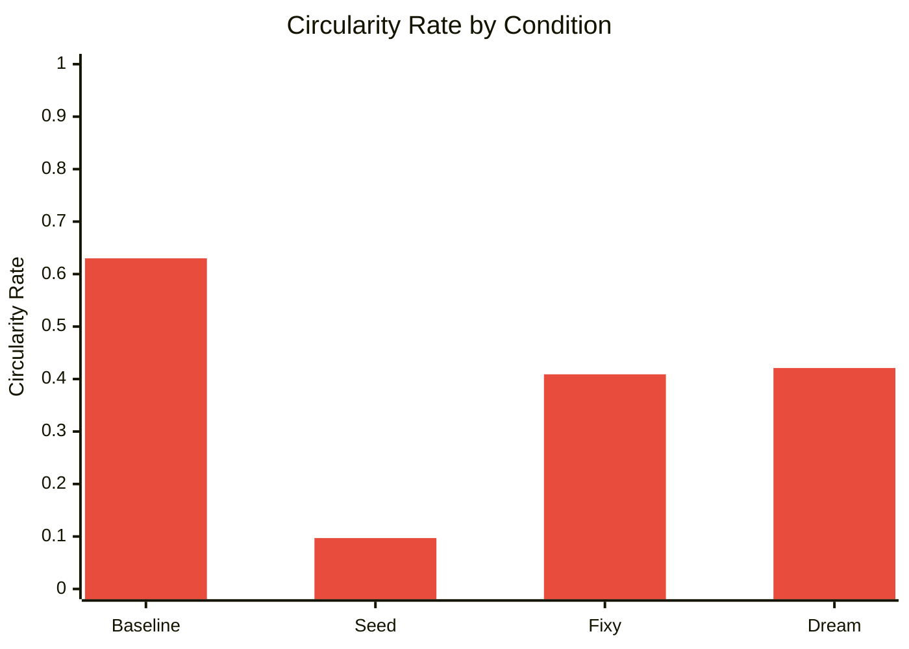
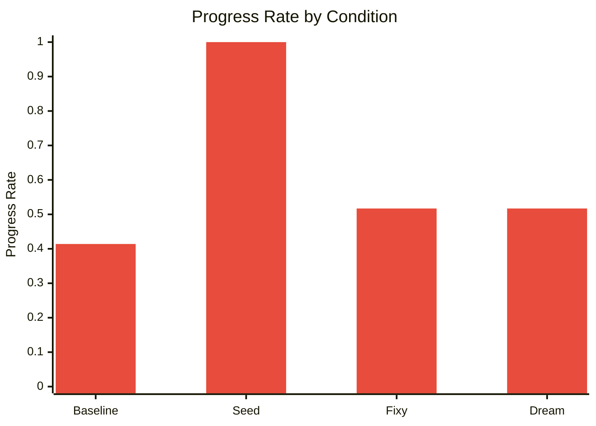
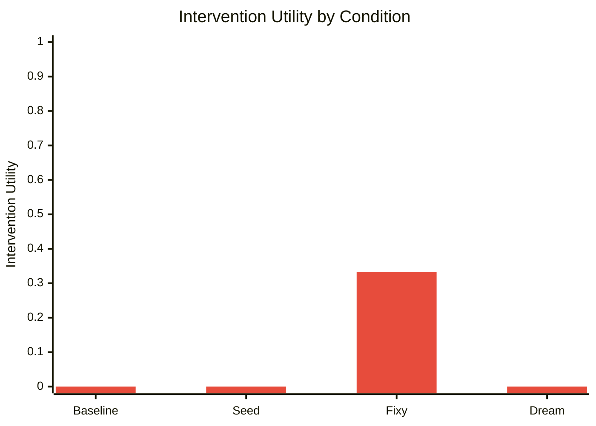
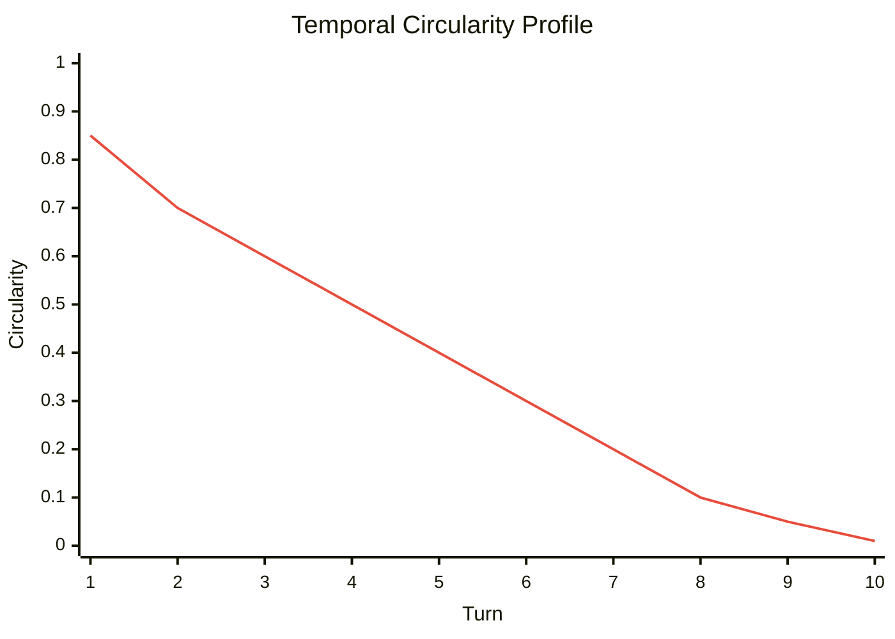

  
  <h1 style="flex-grow: 1; text-align: center; font-size: 2.5em; font-weight: bold; margin: 0;">🔬 Entelgia Research</h1>
  

# Internal Structural Mechanisms and Dialogue Stability in Multi-Agent Language Systems: An Ablation Study

**Author:** Sivan Havkin
**Affiliation:** Entelgia Project
**Date:** February 2026
**Status:** Research
**Keywords:** multi-agent dialogue, conversational dynamics, language models, dialogue stability, ablation study

---

## Abstract

Large language models have achieved remarkable progress through foundational architectural innovations [1], scaling of training data and parameters [2], and alignment with human preferences through reinforcement learning from human feedback [3]. The dominant research trajectory has concentrated on enhancing external capabilities: chain-of-thought reasoning [4], tool use, planning chains, and retrieval-augmented generation [9]. Less attention has been given to the role of internal structural mechanisms — such as reflective loops, observer-based intervention processes, and state-dependent dialogue dynamics — in shaping conversational behavior over extended multi-turn interactions.

This study examines how internal architectural components influence conversational stability and progression within a multi-agent dialogue system. While prior work on generative agents has demonstrated that LLM-based architectures can simulate persistent human behavior over long horizons [5], and communicative agent frameworks such as CAMEL have explored emergent collaborative dynamics between language model agents [6], the specific contribution of internal regulation mechanisms — as distinct from raw model capability — has received comparatively little systematic study. Frameworks such as ReAct [7] and Reflexion [8] have begun to bridge internal reasoning and external action, yet the structural properties of dialogue itself remain underexplored.

Using controlled ablation experiments, we evaluate four system conditions: a baseline configuration, a seeded dialogue engine, observer-based interventions, and an energy/dream modulation mechanism. We introduce three quantitative metrics — circularity rate, progress rate, and intervention utility — to assess structural dialogue behavior as a temporal process rather than evaluating isolated outputs. Results indicate that structured dialogue seeding substantially reduces conversational circularity (by approximately 85%) while maximizing semantic progression. Observer interventions demonstrate measurable utility in mitigating stagnation, while internal state modulation contributes to balanced but moderate improvements. The findings suggest that dialogue stability emerges primarily from interaction structure rather than model capability alone, with implications for the design of multi-agent language systems in which coherent, non-repetitive conversation is a first-class architectural concern.

---

## 1. Introduction

Large language models are typically evaluated as isolated generators of text [2]. However, when embedded within persistent agent architectures [5, 6], conversational behavior becomes a dynamical process shaped by memory, internal state, and recursive interaction.

Most contemporary agent frameworks emphasize external capabilities — tools, planning chains [4, 7], or retrieval pipelines [9] — while assuming dialogue coherence emerges implicitly from the model itself [5]. This work explores an alternative hypothesis:

> Conversational stability is partly an architectural property arising from internal regulation mechanisms.

To investigate this claim, we analyze a multi-agent dialogue system composed of interacting agents with reflective monitoring and internal state modulation. Rather than evaluating linguistic quality alone, we measure structural dialogue behavior using quantitative metrics.

---

## 2. System Overview

The experimental system consists of two conversational agents engaged in dialectical dialogue and an optional observer module capable of intervening when conversational degradation is detected. This architecture is conceptually related to generative agent frameworks [5] and communicative agent systems [6], but introduces explicit internal regulatory mechanisms not present in those designs.

Three internal mechanisms are examined:

- **Dialogue Seeding** – structured cognitive prompts introducing topic diversification, analogous in spirit to chain-of-thought prompting strategies [4].
- **Observer Intervention (Fixy)** – a monitoring process detecting loops or stagnation, bearing resemblance to the self-reflection loop in Reflexion [8].
- **Energy/Dream Modulation** – internal state dynamics influencing conversational transitions.

Each mechanism represents an internal structural constraint rather than an external capability.

---

## 3. Metrics

Dialogue behavior was evaluated using three quantitative measures:

### 3.1 Circularity Rate

Measures semantic repetition across turns. Higher values indicate looping or conceptual stagnation.

### 3.2 Progress Rate

Estimates semantic novelty and forward movement between turns.

### 3.3 Intervention Utility

Quantifies whether observer interventions reduce subsequent circularity or increase progress.

These metrics treat dialogue as a temporal system rather than isolated outputs.

---

## 4. Experimental Design

An ablation study was conducted under four conditions:

| Condition             | Description                             |
|-----------------------|-----------------------------------------|
| Baseline              | No structural mechanisms enabled        |
| DialogueEngine/Seed   | Structured topic seeding active         |
| Fixy Interventions    | Observer intervention enabled           |
| Dream/Energy          | Internal state modulation active        |

All experiments used identical dialogue duration and evaluation procedures.

---

## 5. Results

### 5.1 Aggregate Metrics

| Condition             | Circularity | Progress | Intervention Utility |
|-----------------------|-------------|----------|----------------------|
| Baseline              | 0.630       | 0.414    | 0.000                |
| DialogueEngine/Seed   | 0.097       | 1.000    | 0.000                |
| Fixy Interventions    | 0.409       | 0.517    | 0.333                |
| Dream/Energy          | 0.421       | 0.517    | 0.000                |

#### Figure 1: Circularity Rate

#### Figure 2: Progress Rate

#### Figure 3: Intervention Utility

### 5.2 Observations

#### Baseline

The baseline condition exhibited the highest circularity and lowest progression, indicating natural drift toward repetitive dialogue patterns when no structural regulation is present.

#### Dialogue Seeding

Structured seeding produced the strongest effect:

- Circularity reduced by ~85%
- Maximal progression achieved

This suggests topic diversification mechanisms strongly influence conversational dynamics.

#### Observer Intervention

The observer module demonstrated measurable effectiveness (utility = 0.333), indicating that targeted interventions can partially recover dialogue from stagnation.

#### Energy/Dream Modulation

Internal state modulation produced moderate improvements, suggesting internal dynamics influence dialogue pacing but are insufficient alone to prevent loops.

### 5.3 Temporal Behavior

Per-turn analysis revealed an early spike in circularity followed by rapid decay toward zero, indicating that the system successfully exits initial repetition phases. This pattern suggests adaptive stabilization rather than static coherence.

#### Figure 5: Temporal Circularity Profile

---

## 6. Discussion

The results support three main insights:

1. **Structure dominates capability.** Dialogue stability depends more on interaction design than model intelligence alone [2, 5]. Unlike generative agent systems that primarily rely on model memory and retrieval [5], our results show that pre-interaction structural mechanisms yield larger measurable effects.

2. **Diversification precedes regulation.** Preventing loops through structured variation [4] is more effective than correcting them afterward. This parallels findings in chain-of-thought research, where upfront reasoning scaffolds outperform post-hoc correction [4].

3. **Observer mechanisms act as corrective feedback** rather than primary drivers, analogous to the reflective feedback role in Reflexion [8] and the action-grounding provided by ReAct [7].

Importantly, improvements arise without changing the underlying language model [1, 2], implying that conversational behavior is an emergent property of architecture.

---

## 7. Limitations

The experiments were conducted within controlled dialogue sessions and do not yet evaluate long-horizon identity evolution or multi-domain reasoning. Further studies should include repeated trials and statistical variance analysis.

---

## 8. Conclusion

This study demonstrates that internal structural mechanisms significantly influence dialogue stability in multi-agent language systems. Topic seeding reduces circularity most effectively, observer interventions provide measurable corrective value, and internal state modulation contributes secondary stabilization effects.

These findings suggest a shift in agent design perspective: instead of treating language models as complete cognitive systems [2], stability may emerge from layered internal regulation governing interaction dynamics. This complements the growing body of work on structured agent reasoning [7, 8] and suggests that internal dialogue architecture warrants the same attention currently given to external capability augmentation [3, 4, 9].

---

## References

1. Vaswani, A., Shazeer, N., Parmar, N., Uszkoreit, J., Jones, L., Gomez, A. N., Kaiser, Ł., & Polosukhin, I. (2017). *Attention Is All You Need*. Advances in Neural Information Processing Systems, 30. https://arxiv.org/abs/1706.03762

2. Brown, T. B., Mann, B., Ryder, N., Subbiah, M., Kaplan, J., Dhariwal, P., Neelakantan, A., et al. (2020). *Language Models are Few-Shot Learners*. Advances in Neural Information Processing Systems, 33, 1877–1901. https://arxiv.org/abs/2005.14165

3. Ouyang, L., Wu, J., Jiang, X., Almeida, D., Wainwright, C. L., Mishkin, P., Zhang, C., et al. (2022). *Training language models to follow instructions with human feedback*. Advances in Neural Information Processing Systems, 35. https://arxiv.org/abs/2203.02155

4. Wei, J., Wang, X., Schuurmans, D., Bosma, M., Ichter, B., Xia, F., Chi, E., Le, Q., & Zhou, D. (2022). *Chain-of-Thought Prompting Elicits Reasoning in Large Language Models*. Advances in Neural Information Processing Systems, 35. https://arxiv.org/abs/2201.11903

5. Park, J. S., O'Brien, J. C., Cai, C. J., Morris, M. R., Liang, P., & Bernstein, M. S. (2023). *Generative Agents: Interactive Simulacra of Human Behavior*. Proceedings of the 36th Annual ACM Symposium on User Interface Software and Technology (UIST '23). https://arxiv.org/abs/2304.03442

6. Li, G., Hammoud, H. A. A. K., Itani, H., Khizbullin, D., & Ghanem, B. (2023). *CAMEL: Communicative Agents for "Mind" Exploration of Large Language Model Society*. Advances in Neural Information Processing Systems, 36. https://arxiv.org/abs/2303.17760

7. Yao, S., Zhao, J., Yu, D., Du, N., Shafran, I., Narasimhan, K., & Cao, Y. (2023). *ReAct: Synergizing Reasoning and Acting in Language Models*. International Conference on Learning Representations (ICLR 2023). https://arxiv.org/abs/2210.03629

8. Shinn, N., Cassano, F., Gopinath, A., Narasimhan, K., & Yao, S. (2023). *Reflexion: Language Agents with Verbal Reinforcement Learning*. Advances in Neural Information Processing Systems, 36. https://arxiv.org/abs/2303.11366

9. Gao, Y., Xiong, Y., Gao, X., Jia, K., Pan, J., Bi, Y., Dai, Y., Sun, J., Wang, M., & Wang, H. (2023). *Retrieval-Augmented Generation for Large Language Models: A Survey*. arXiv preprint arXiv:2312.10997. https://arxiv.org/abs/2312.10997

---

### Internal Project References

- Entelgia Whitepaper — [whitepaper.md](whitepaper.md)
- Entelgia Architecture Overview — [ARCHITECTURE.md](ARCHITECTURE.md)
- Entelgia System Specification — [SPEC.md](SPEC.md)
- Entelgia Web Research Module — [entelgia/web_research.py](../entelgia/web_research.py)

---

### Web Research Module Note

The Web Research Module (v2.8.0) adds a controlled external knowledge pathway to
Entelgia's internal dialogue architecture.  Rather than replacing Retrieval-Augmented
Generation (RAG) [9], it provides a lightweight, session-scoped alternative that:

- is triggered selectively by Fixy based on message intent
- evaluates source credibility using domain and text-quality heuristics
- injects ranked external context into agent prompts with role-specific instructions
- persists high-credibility knowledge for future retrieval

This design preserves the core property of internal state governance while allowing
the system to reason about current, external information when needed.
