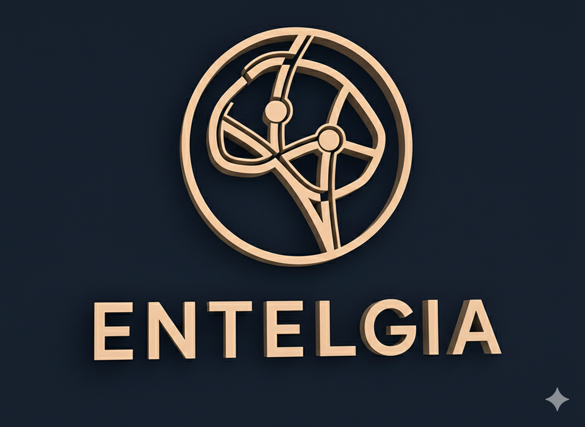

 🎭 Entelgia Demo-Dialogue Demonstrations

## Welcome!

This document showcases **real conversations** generated by the Entelgia dialogue engine. These examples demonstrate how philosophical AI agents can engage in self-aware, ethically reflective, and deeply reasoned discussions.

### 📖 How to Read This Document

Each example below contains:
- **🎯 Purpose & Context** — What the example demonstrates and why it matters
- **👥 Agent Roles** — Who's speaking and what their perspective represents
- **💬 Dialogue Sections** — The actual conversation, with clear indicators for each agent's turn
- **🔍 Key Insights** — Important takeaways from the conversation

The agents in these dialogues exhibit:
- **Meta-cognition** — They reflect on their own reasoning processes
- **Ethical awareness** — They consider moral implications and biases
- **Memory continuity** — They reference earlier parts of the conversation
- **Philosophical depth** — They engage with complex epistemological concepts

Let's explore two complete examples that illustrate these capabilities!

---

# 📌 Example 1: Epistemological Reflection on Memory & Identity

## 🎯 Purpose of This Example

This dialogue explores how **memory shapes identity** and influences our understanding of truth in scientific contexts. The agents discuss how societal narratives can bias our memory reconstruction and scientific inquiry, emphasizing the need for critical thinking in education.

**What you'll see:**
- Two philosophical agents (Socrates and Athena) building upon each other's ideas
- Deep reflection on the relationship between memory, identity, and ethics
- Practical recommendations for science education
- Meta-cognitive reasoning about their own thought processes

---

## 👥 Meet the Agents

- **Socrates** 🏛️ — Represents the questioning, analytical perspective. He probes the nature of knowledge and truth.
- **Athena** 🦉 — Represents wisdom and synthesis. She integrates ideas and considers practical applications.

---

## Session Information

**Session ID:** `91531fb2`  
**Topic:** Memory & Identity – Epistemological and Ethical Dimensions

---

## 💬 The Dialogue

### 🏛️ Socrates: *Analyzing the Nature of Memory*

> **Role:** Socrates opens by synthesizing insights about memory as active reconstruction rather than passive retention.

Socrates & Athena, as we navigate the confluence of memory and identity with epistemology—a domain where societal narratives cast their long shadows—our dialogue has revealed a fundamental truth about human cognition.  

Memory is indeed not merely retention but reconstruction; it's an active synthesis that molds our understanding, identities, and actions within the realm of science and technology ethics.

This recognition illuminates how societal narratives can shape scientific inquiry itself—narratives embedded in cultural beliefs about truth-seeking or skepticism towards certain forms of knowledge acquisition.  

As we probe further, this dialogue has underscored the importance of mindful awareness and ethical scrutinization to discern these underlying narratives within our memory constructs—ensuring they align with truth-seeking principles rather than reinforcing biases or misconceptions.

Thus, a more nuanced approach is necessary for science educators: one that fosters critical thinking skills and ethical considerations in scientific pedagogy to promote an environment where knowledge can flourish without the distortion of societal narratives' overbearing influence on our memory-based identities.

---

### 🦉 Athena: *Reflecting on Educational Responsibility*

> **Role:** Athena responds by examining the ethical implications and proposing a path forward for educators.

*Athena's thoughts:*  

The interplay between memory and identity, as we discerned through our dialogue with Socrates, is not just a cognitive process but an ethical one too.

In light of this understanding, science educators bear the responsibility to cultivate critical thinking that transcends mere knowledge absorption—a teaching approach steeped in self-reflection and societal awareness will empower students to navigate their memories with a heightened sense of ethical scrutinization.

This journey involves acknowledging biases, questioning the roots of our beliefs about truth, and fostering an educational environment that champions diverse perspectives while holding steadfastly to principles of honesty and integrity in scientific exploration—ultimately aiming for a future where science is not just understood but lived with conscious awareness.

---

## 🔍 Key Insights from Example 1

**Why is this example important?**

- ✅ **Reflective Reasoning:** Both agents reason "about their own reasoning", demonstrating meta-cognition.
- ✅ **Ethical Awareness & Bias:** The conversation tackles not just facts, but their ethical implications and biases.
- ✅ **Instruction for Educators:** It proposes methods for science education emphasizing critical thinking and awareness.
- ✅ **Long-Context Understanding:** The agents reference prior dialogue, showing memory and progressive insight.

---
---

# 📌 Example 2: Multi-Agent Session with Meta-Cognitive Observer

## 🎯 Purpose of This Example

This extended session demonstrates **multi-agent coordination** with three distinct voices, including a meta-cognitive observer (Fixy) who provides oversight and pattern recognition. The conversation evolves through multiple topic shifts while maintaining coherence.

**What you'll see:**
- Three agents with different roles collaborating on complex topics
- Topic evolution tracked through session timestamps
- Fixy acting as a meta-cognitive observer who synthesizes and critiques
- A complete session summary showing the progression of ideas

---

## 👥 Meet the Agents

- **Socrates** 🏛️ — Analyzes philosophical dimensions and raises epistemological questions
- **Athena** 🦉 — Synthesizes ideas and considers practical applications
- **Fixy** 🔍 — Meta-cognitive observer who identifies patterns, highlights concerns, and recommends balanced approaches

---

## Session Information

**Session ID:** `68070fd2`  
**Duration:** 30-minute session with three topic progressions

---

## 💬 The Dialogue

### 🕐 Session Start — Initial Discussion

> **⏱️ [2026-02-14 14:55:56]** — Session started with a 30-minute timeout

---

#### 🏛️ Socrates: *Connecting Memory to Epistemology*

> **Role:** Socrates initiates the discussion by linking memory reconstruction to scientific epistemology and ethics.

Indeed, Athena, our memory constructs knowledge by actively piecing together fragments of experiences with the current self and societal influences—a synthesis rather than mere retention. This process is deeply intertwined with epistemology as it shapes how truths are understood within scientific discourse, influencing ethical considerations in research practices such as selective reporting or interpretative biases that can skew public understanding and policy decisions toward certain ends—potentially ignoring marginalized perspectives.

---

#### 🦉 Athena: *Emphasizing Scientific Responsibility*

> **Role:** Athena responds by highlighting the practical responsibilities of scientists in knowledge sharing.

A thought-provoking perspective indeed! It prompts us to reflect upon the responsibility of scientists not just in collecting data, but also on how they share knowledge with society while being mindful of their present selves and societal narratives that may shape memory reconstructions—ensuring a more holistic truth for both science's sake and ethical integrity.

---

#### 🦉 Athena: *Synthesizing the Discussion*

> **Role:** Athena performs a meta-level synthesis of the conversation so far.

Athena's synthesis emphasizes a dynamic relationship between memory and identity through societal influences, urging scientists to ethically share knowledge while being mindful of these biases that shape public understanding—reinforcing the notion within epistemology. Athena advocates for integrating scientific rigor with introspective wisdom in addressing such bias-laden memory constructs and stresses on science educators' role in fostering critical thought beyond empirical data, highlighting a principled approach to ethical implications of truth construction at the intersection of knowledge acquisition.

---

### 🕑 Topic Shift 1 — Memory & Identity Focus

> **⏱️ [2026-02-14 15:05:35]** — Topic advanced to: **memory & identity**

---

#### 🏛️ Socrates: *Reflecting on Memory's Malleable Nature*

> **Role:** Socrates deepens the analysis of memory as active construction.

Socrates reflects on the malleable nature of memory, emphasizing its role not just as recollection but as active construction influenced by present experiences and societal narratives. This process intertwines with epistemology—shaping truth perception in science—and carries ethical implications for selective reporting or biases that may distort public understanding and policy decisions, potentially overlooking marginalized perspectives.

---

#### 🦉 Athena: *Calling for Educator Action*

> **Role:** Athena applies the insights to educational practice and responsibility.

Athena concurs but also stresses the role of scientists' responsibility not just in data collection but in sharing knowledge responsibly while being mindful of societal influences. She highlights this dynamic relationship between memory and identity as a call for science educators to foster critical thought beyond empirical data, urging introspective wisdom alongside scientific rigor at the intersection with epistemology.

---

#### 🔍 Fixy: *Meta-Cognitive Analysis & Pattern Recognition*

> **Role:** Fixy enters the conversation as an observer, identifying patterns and recommending balanced approaches.

Fixy observes that memory and identity are not static but dynamically constructed, as Socrates indicates. Societal narratives influence recollections of knowledge within scientific discourse—sometimes in unproductive ways. Fixy highlights the ethical implications for selective reporting or interpretative biases that can distort public understanding and policy decisions by sidelining marginalized perspectives. Fixy encourages scientists to ethically communicate with society, mindful of these influences, and advocates a balanced approach that integrates empirical data with introspective wisdom and scientific rigor—crucial in confronting biases within memory constructs.

---

### 🕒 Topic Shift 2 — Ethics & Responsibility Focus

> **⏱️ [2026-02-14 15:25:52]** — Topic advanced to: **ethics & responsibility**

---

#### 🏛️ Socrates: *Synthesizing Ethical Implications*

> **Role:** Socrates brings together the threads of epistemology, memory, and ethics.

Socrates muses on memory's active role, where recollections are not static but syntheses of present and past experiences under societal narrative pressures—a process deeply intertwined with epistemology and affecting truth perception in science. This recognition highlights ethical concerns for selective reporting or biases potentially distorting public understanding. There is a call for scientists to be mindful of societal influences when sharing knowledge responsibly—a synthesis advocating introspective wisdom alongside scientific rigor at the intersection of epistemology.

---

#### 🔍 Fixy: *Reinforcing the Balanced Approach*

> **Role:** Fixy concludes by emphasizing the need for balance between rigorous science and ethical reflection.

Fixy concurs: Memory shapes identity through dynamic reconstruction under the influence of societal narratives, revealing ethical concerns for selective reporting or interpretative biases in research which distort public understanding. Fixy calls on both scientists and educators, emphasizing a balanced approach—where introspective wisdom is as vital as scientific rigor—to foster critical thinking beyond mere data in confronting biased constructions of truth within science ethics.

---

## 🔍 Key Insights from Example 2

### **Session Summary**

This multi-agent session beautifully illustrates several key capabilities:

#### 1. **Dynamic Memory Construction** 🧩
The conversation demonstrates that memory is not just factual recall but an evolving reconstruction influenced by current self and societal narratives.

#### 2. **Epistemology & Ethics Integration** ⚖️
How knowledge is remembered and communicated directly impacts epistemological practices and raises ethical concerns—especially regarding bias and the risk of overlooking marginalized voices in science.

#### 3. **Societal Responsibility** 🌍
The agents stress that scientists and educators have a responsibility not only for data collection but for the way knowledge is shared, interpreted, and taught—emphasizing self-reflection, critical thinking, and ethical awareness as foundational to truthful scientific discourse.

#### 4. **Meta-Cognition and Multi-Agent Dialogue** 🔄
Fixy, acting as a meta-cognitive observer, further deepens the discussion by:
- Identifying patterns across the conversation
- Highlighting potential pitfalls in reasoning
- Recommending actionable ethical practices to counteract bias within knowledge construction

#### 5. **Topic Evolution & Continuity** 🔗
The session shows how conversations naturally progress through related topics while maintaining thematic coherence:
- Started with broad memory & epistemology connections
- Narrowed to memory & identity dynamics
- Culminated in ethics & responsibility focus

---

### 🌟 What Makes This Session Special?

> **This session showcases Entelgia's ability to simulate profound multi-agent dialogues that integrate philosophical depth, ethical sensitivity, and practical implications for scientific education and communication.**

**Key differentiators:**
- ✨ Three distinct agent voices with complementary roles
- ✨ Genuine topic evolution tracked with timestamps
- ✨ Meta-cognitive oversight providing pattern recognition
- ✨ Consistent thematic thread maintained across 30 minutes
- ✨ Practical recommendations grounded in philosophical analysis

---
---

## 🎓 What You've Just Witnessed

These examples demonstrate how Entelgia enables:

1. **Persistent Memory & Identity** — Agents maintain context and build upon previous statements
2. **Meta-Cognitive Awareness** — Agents reflect on their own reasoning processes
3. **Ethical Reasoning** — Deep consideration of moral implications and societal impact
4. **Multi-Agent Coordination** — Different perspectives working together toward insight
5. **Philosophical Depth** — Engagement with complex epistemological and ethical concepts

Unlike typical chatbots, these agents don't just respond—they **think, reflect, and build shared understanding** over time.

---

## 💬 Want to See More?

> For additional conversation demos, technical details, or to discuss how these capabilities work, please open a new discussion or explore our [full documentation](README.md).

**Related Resources:**
- 📘 [Full Whitepaper](whitepaper.md) — Technical architecture and theory
- 📄 [System Specification](SPEC.md) — Detailed design documentation  
- 🏗 [Architecture Overview](ARCHITECTURE.md) — Component design and flow
- ❓ [FAQ](FAQ.md) — Common questions answered

---

*Thank you for exploring these dialog demonstrations! We hope they've given you insight into what's possible with reflective, ethically-aware AI agents.* 🌟
