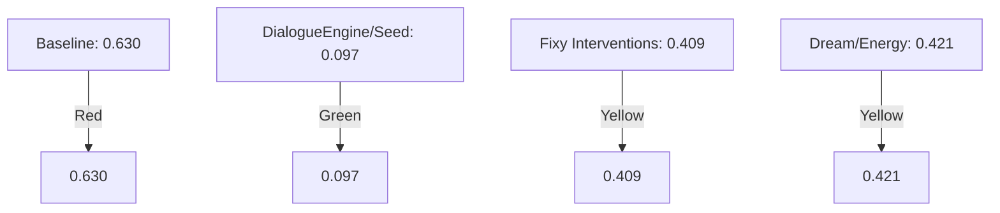
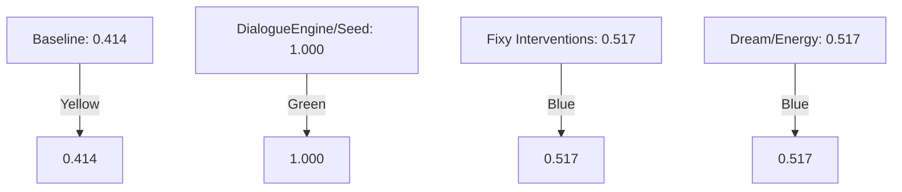
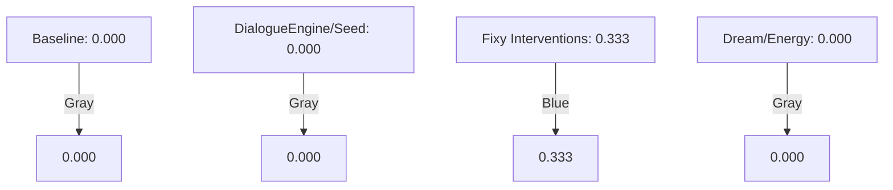
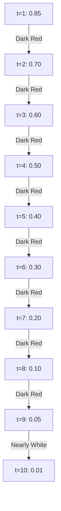

# Research Document

## Section 5.1: Visualizations

### Figure 1: Circularity Rate

### Figure 2: Progress Rate

### Figure 3: Intervention Utility

### Figure 4: All Metrics

| Intervention           | Performance Indicator |
|------------------------|----------------------|
| Baseline               | 🔴                   |
| DialogueEngine/Seed    | 🟢                   |
| Fixy Interventions      | 🔵                   |
| Dream/Energy           | 🔴                   |

## Section 5.3: Temporal Circularity Profile
### Figure 5: Temporal Circularity Profile

