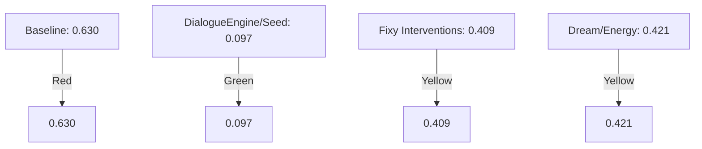
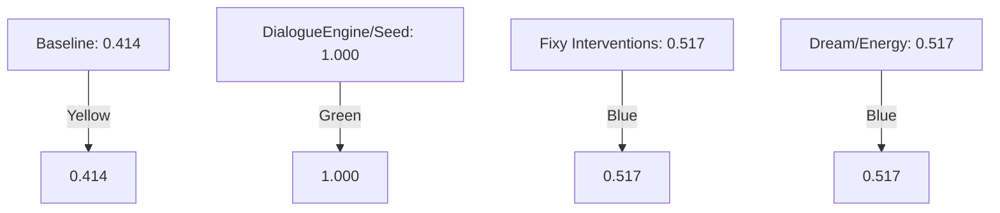
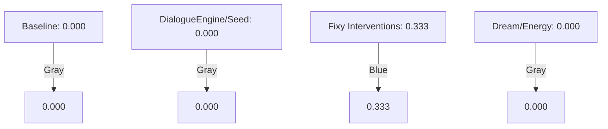
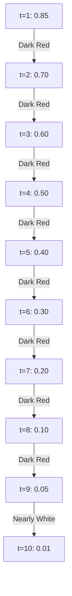

Internal Structural Mechanisms and Dialogue Stability in Multi-Agent Language Systems: An Ablation Study
Abstract

Recent work in language-model–based agents has largely focused on external tooling, prompt engineering, and retrieval augmentation. Less attention has been given to the role of internal structural mechanisms such as reflective loops, intervention processes, and state-dependent dialogue dynamics.
This study examines how internal architectural components influence conversational stability and progression within a multi-agent dialogue system. Using controlled ablation experiments, we evaluate four system conditions: a baseline configuration, a seeded dialogue engine, observer-based interventions, and an energy/dream modulation mechanism. Results indicate that structured dialogue seeding substantially reduces conversational circularity while maximizing semantic progression. Observer interventions demonstrate measurable utility in mitigating stagnation, while internal state modulation contributes to balanced but moderate improvements. The findings suggest that dialogue stability emerges primarily from interaction structure rather than model capability alone.

1. Introduction

Large language models are typically evaluated as isolated generators of text. However, when embedded within persistent agent architectures, conversational behavior becomes a dynamical process shaped by memory, internal state, and recursive interaction.

Most contemporary agent frameworks emphasize external capabilities — tools, planning chains, or retrieval pipelines — while assuming dialogue coherence emerges implicitly from the model itself. This work explores an alternative hypothesis:

conversational stability is partly an architectural property arising from internal regulation mechanisms.

To investigate this claim, we analyze a multi-agent dialogue system composed of interacting agents with reflective monitoring and internal state modulation. Rather than evaluating linguistic quality alone, we measure structural dialogue behavior using quantitative metrics.

2. System Overview

The experimental system consists of two conversational agents engaged in dialectical dialogue and an optional observer module capable of intervening when conversational degradation is detected.

Three internal mechanisms are examined:

Dialogue Seeding – structured cognitive prompts introducing topic diversification.

Observer Intervention (Fixy) – a monitoring process detecting loops or stagnation.

Energy/Dream Modulation – internal state dynamics influencing conversational transitions.

Each mechanism represents an internal structural constraint rather than an external capability.

3. Metrics

Dialogue behavior was evaluated using three quantitative measures:

3.1 Circularity Rate

Measures semantic repetition across turns.
Higher values indicate looping or conceptual stagnation.

3.2 Progress Rate

Estimates semantic novelty and forward movement between turns.

3.3 Intervention Utility

Quantifies whether observer interventions reduce subsequent circularity or increase progress.

These metrics treat dialogue as a temporal system rather than isolated outputs.

4. Experimental Design

An ablation study was conducted under four conditions:

Condition	Description
Baseline	No structural mechanisms enabled
DialogueEngine/Seed	Structured topic seeding active
Fixy Interventions	Observer intervention enabled
Dream/Energy	Internal state modulation active

All experiments used identical dialogue duration and evaluation procedures.

5. Results
5.1 Aggregate Metrics
Condition	Circularity	Progress	Intervention Utility
Baseline	0.630	0.414	0.000
DialogueEngine/Seed	0.097	1.000	0.000
Fixy Interventions	0.409	0.517	0.333
Dream/Energy	0.421	0.517	0.000
5.2 Observations
Baseline

The baseline condition exhibited the highest circularity and lowest progression, indicating natural drift toward repetitive dialogue patterns when no structural regulation is present.

Dialogue Seeding

Structured seeding produced the strongest effect:

circularity reduced by ~85%

maximal progression achieved

This suggests topic diversification mechanisms strongly influence conversational dynamics.

Observer Intervention

The observer module demonstrated measurable effectiveness (utility = 0.333), indicating that targeted interventions can partially recover dialogue from stagnation.

Energy/Dream Modulation

Internal state modulation produced moderate improvements, suggesting internal dynamics influence dialogue pacing but are insufficient alone to prevent loops.

5.3 Temporal Behavior

Per-turn analysis revealed an early spike in circularity followed by rapid decay toward zero, indicating that the system successfully exits initial repetition phases. This pattern suggests adaptive stabilization rather than static coherence.

6. Discussion

The results support three main insights:

Structure dominates capability.
Dialogue stability depends more on interaction design than model intelligence alone.

Diversification precedes regulation.
Preventing loops through structured variation is more effective than correcting them afterward.

Observer mechanisms act as corrective feedback rather than primary drivers.

Importantly, improvements arise without changing the underlying language model, implying that conversational behavior is an emergent property of architecture.

7. Limitations

The experiments were conducted within controlled dialogue sessions and do not yet evaluate long-horizon identity evolution or multi-domain reasoning. Further studies should include repeated trials and statistical variance analysis.

8. Conclusion

This study demonstrates that internal structural mechanisms significantly influence dialogue stability in multi-agent language systems. Topic seeding reduces circularity most effectively, observer interventions provide measurable corrective value, and internal state modulation contributes secondary stabilization effects.

These findings suggest a shift in agent design perspective: instead of treating language models as complete cognitive systems, stability may emerge from layered internal regulation governing interaction dynamics.

Keywords

multi-agent dialogue, conversational dynamics, language models, dialogue stability,

## Section 5.1: Visualizations

### Figure 1: Circularity Rate

### Figure 2: Progress Rate

### Figure 3: Intervention Utility

### Figure 4: All Metrics

| Intervention           | Performance Indicator |
|------------------------|----------------------|
| Baseline               | 🔴                   |
| DialogueEngine/Seed    | 🟢                   |
| Fixy Interventions      | 🔵                   |
| Dream/Energy           | 🔴                   |

## Section 5.3: Temporal Circularity Profile
### Figure 5: Temporal Circularity Profile

